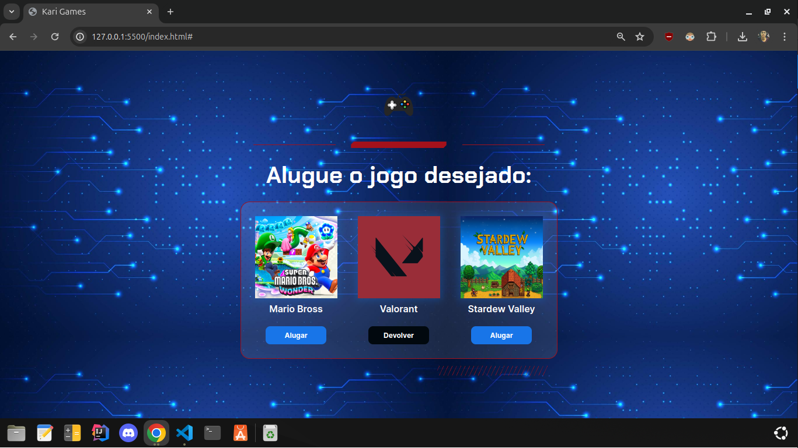

# Alugames

Praticando lógica e estilização com o projeto Alura Games

## 🚀 Aprendizado

- Utilização de elementos de **JavaSript** em aplicação com **CSS** para manipulação de botões e cores em páginas estáticas na web.

- Manipulação de elementos através de botões com o objetivo de simular o aluguel de um jogo com visual estilizado por mim, alterando o design que veio pré-definido.

- Recuperar elementos da página com JavaScript, com o uso das funções document.querySelector() e document.getElementById();

- Declarar variáveis no JavaScript para armazenar elementos recuperados da página;

- Acessar a lista de classes que um elemento da página possui, via propriedade classList;

- Verificar se um elemento da página possui uma determinada classe CSS, via função classList.contains();

- Remover uma classe CSS de um elemento da página, via função classList.remove();

- Adicionar uma classe CSS a um elemento da página, via função classList.add();

- Alterar o texto de um elemento da página, via propriedade textContent;

- Declarar um bloco condicional if/else, para implementar a funcionalidade de alterar o status de um jogo (alugar ou devolver).

 

  

    
    </a>
  

 

## 🛠 Tecnologia aplicada

HTML, CSS, JavaScript